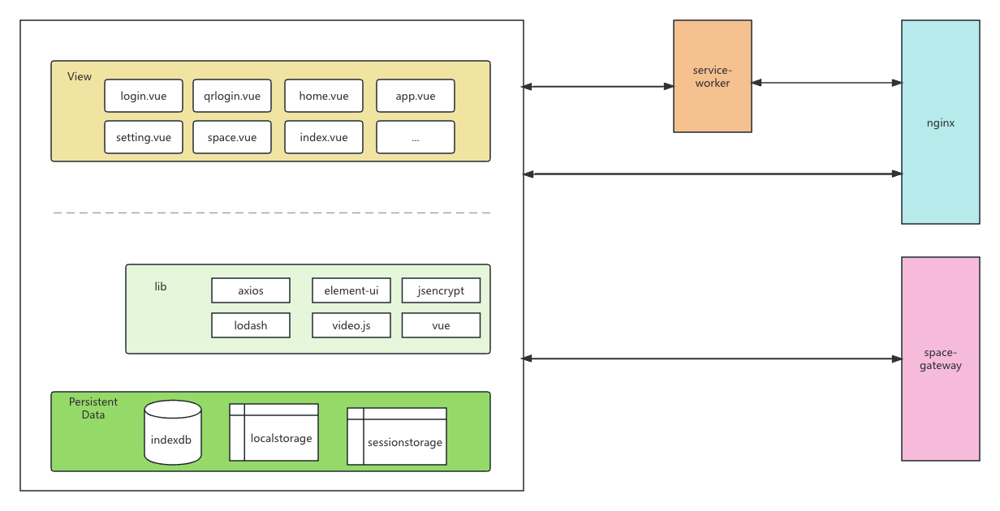
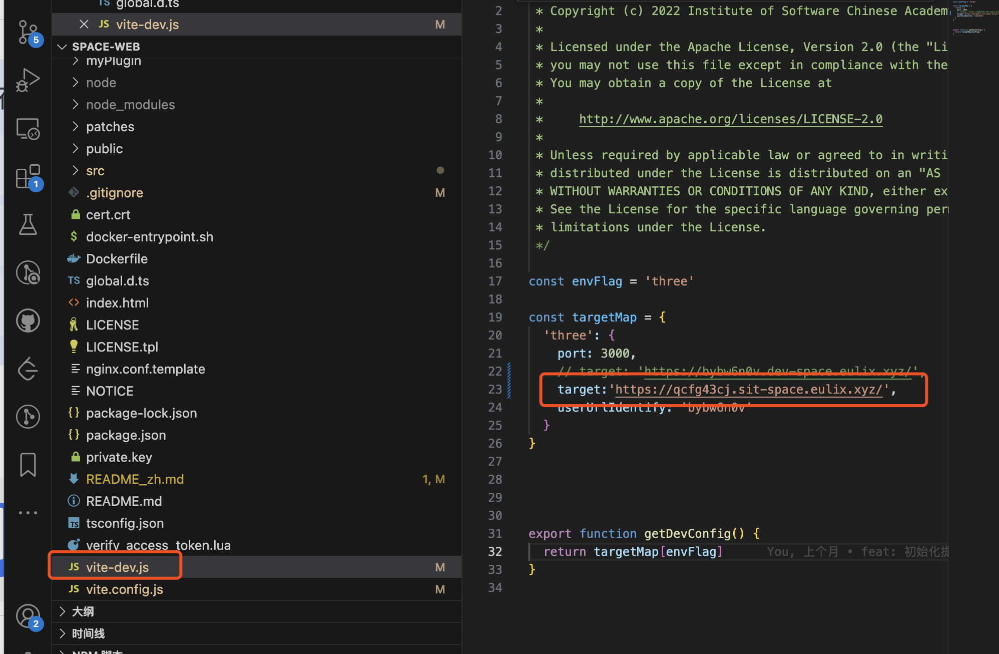
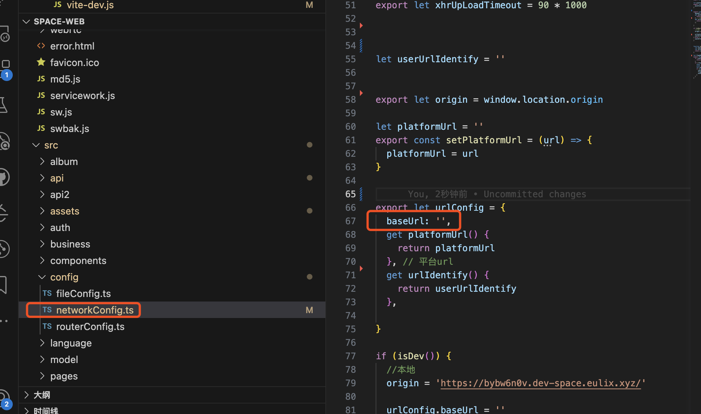

# Introduction to space-web

- [Introduction](#introduction)
- [Architecture Design](#architecture-design)
- [Development Instructions](#development-instructions)
- [Deployment Instructions](#deployment-instructions)
- [Contribution Guidelines](#contribution-guidelines)
  - [Contribute Code](#contribute-code)
  - [Code Quality](#code-quality)
  - [Commit Information](#commit-information)
  - [Issue Reporting](#issue-reporting)
  - [Feature Requests](#feature-requests)
- [Thank You for Contributing](#thank-you-for-contributing)
- [中文文档](/README_zh.md)

## Introduction

space-web is the web component of AO.space. It utilizes technologies like PWA (Progressive Web App) and IndexedDB to provide users with a good frontend experience.

space-web offers basic file management functionalities. After opening the space-web interface and logging in, users can upload files, create folders, delete files, rename files, copy and move files, and more. Additionally, space-web includes a recycle bin feature where users can find deleted files from the file management system and restore or permanently delete them. Finally, users can personalize their settings by setting avatars, signatures, and more.

### Architecture Design

space-web is developed using JavaScript and utilizes technologies such as Vue3, Element-plus, Axios, Jsencrypt, and service-worker. The business layer includes pages such as login, quick login, mine, and homepage, and uses web localization technology to ensure smooth file operations.

### Development Instructions

1. Enter your working directory and run the command `git clone https://github.com/ao-space/space-web.git`.
2. Enter the space-web directory `cd ./space-web`.
3. Install dependencies by running `npm install`.
4. Run `npm run dev` for development.
6. This project is the web component of AO.space, and the server-side interface uses the [space-gateway](https://github.com/ao-space/space-gateway) interface. When developing, please modify the target property in the vite-dev file in the root directory to point to the space-gateway interface address.
See the following image for details.

### Deployment Instructions

1. Determine the domain name exposed to the outside world for this project and the space-gateway interface domain name.
2. If the domain name exposed to the outside world for this project and the space-gateway interface domain name are inconsistent, modify the baseurl of urlConfig in src/config/networkConfig.ts to the space-gateway interface domain name.
See the following image for details.

3. Run `docker build -t space-web .` in the project root directory.
4. Run the packaged nginx image by executing the command `docker run -d --name space-web -p 80:80 space-web` (Refer to the Docker documentation for specific Docker commands).

## Contribution Guidelines

We welcome contributions to this project. Here are some guidelines and suggestions to help you get involved:

### Contributing Code

The best way to contribute to the project is by submitting code. Before submitting code, make sure you have downloaded and familiarized yourself with the project codebase. Ensure that your code follows the following guidelines:

- Code should be concise, clear, and easy to maintain and extend.
- Code should adhere to the naming conventions established by the project to maintain consistency.
- Code should follow the project's code style guidelines, which can be found in the project's code repository.

To submit code to the project, follow these steps:

- Fork the project on GitHub.
- Clone your forked project to your local machine.
- Make your modifications and improvements locally.
- Run tests to ensure that any changes have no adverse effects.
- Submit your changes and create a new pull request.

### Code Quality

We prioritize code quality, so the code you submit should meet the following requirements:

- Code should be thoroughly tested to ensure correctness and stability.
- Code should follow good design principles and best practices.
- Code should meet the relevant requirements for code contributions.

### Commit Messages

Before submitting your code, make sure to provide meaningful and detailed commit messages. This helps us better understand your code contribution and merge it more quickly.

A commit message should include the following:

- Describe the purpose or reason for the code contribution.
- Describe the content or changes made in the code contribution.
- (Optional) Describe the testing methods or results for the code contribution.

Commit messages should be clear and follow the conventions of the project's code repository.

### Issue Reporting

If you encounter any issues or discover any errors in the project, feel free to submit an issue report. Before submitting an issue report, make sure you have thoroughly investigated and tested the issue, and provide as much information as possible, including:

- Describe the symptoms and manifestations of the issue.
- Describe the scenarios and conditions in which the issue occurs.
- Provide contextual information or any relevant background information.
- Describe the expected behavior.
- (Optional) Provide relevant screenshots or error messages.

Issue reports should be clear and follow the conventions of the project's code repository for issue reporting.

### Feature Requests

If you want to add new features or enhancements to the project, you are welcome to submit feature requests. Before submitting a feature request, make sure you understand the project's history and current state, and provide as much information as possible, including:

- Describe the desired feature or enhancement.
- Describe the purpose and objectives of the feature or enhancement.
- (Optional) Provide relevant implementation ideas or suggestions.

Feature requests should be clear and follow the conventions of the project's code repository for feature requests.

### Thank You for Your Contribution

Finally, thank you for your contribution to this project. We welcome various forms of contributions, including but not limited to code contributions, issue reports, feature requests, and documentation writing. With your help, we believe this project will become more complete and powerful.